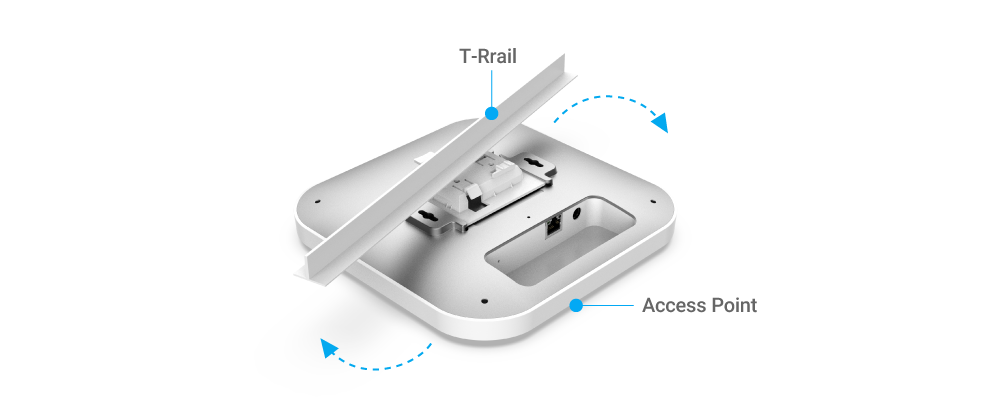

# Hardware Mounting

## <mark style="color:blue;">Hardware Mounting</mark>

The access point can be mounted on the **Ceiling** and **Wall.** Please perform the following steps to install successfully.

### Ceiling Mount

#### - T-Rail

1. &#x20;Slide the **Ceiling Mount Base** into the designated slot on the access point slot of the Access Point.

<figure><figcaption></figcaption></figure>

2\. Slightly hook the ceiling mount bracket onto the T-Rail until you hear a click.

<figure><figcaption></figcaption></figure>

#### - Hard Ceiling

1. Screw the included **Screws** into the **Ceiling Mount Base** with **Spacers**, and then screw the  **Screws** into the surface until they are flush with the surface.

<figure><figcaption></figcaption></figure>

2\. Slide the Access Point into the **Ceiling Mount Base**.

<figure><figcaption></figcaption></figure>

### Wall Mount

1. Determine where the **Access Point** will be placed and mark the location on the surface for the two mounting holes. Use the appropriate drill bit to drill two 8.1mm diagram and 26mm-deep holes on the marks.
2. Screw the **Anchors** into the holes until they are flush with the wall; screw the included **Screws** into the **Anchors** but leave the screw head sticking out so you can hang the **Access Point** on it.

<figure><figcaption></figcaption></figure>

3\. Hang the **Access Point** against the wall onto the **Screw** heads. <mark style="color:red;"></mark>&#x20;

<figure><figcaption></figcaption></figure>
