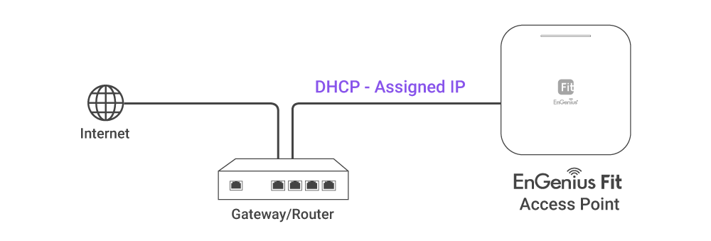

# Option A: Cloud Management

## <mark style="color:blue;">**Option A: Cloud Management with FitXpress**</mark>

### **Step 1: Connecting Ethernet**

Connect the Ethernet cable from the EnGenius Fit AP directly to the DHCP-enabled network **** and make sure the AP can reach the Internet.

<figure><figcaption></figcaption></figure>

### **Step 2: Register Device**

You can register the access point with the **FitXpress app.**

1. Open the **FitXpress** mobile app and create an account.&#x20;
2. Login and go to the **Devices** section. Click the **Add(+)** button.&#x20;
3. Scan the QR code on the back of the device via the app.

<figure><figcaption></figcaption></figure>

.png>)

4\. If the camera successfully scans the QR code, the app will display the device information. You can tap "**Register**" **** to complete the registration.

<figure><figcaption></figcaption></figure>

### Step 3: Connect to FitXpress

Once the device is powered on and ready to connect to the Internet, the **PWR LED** will stay _<mark style="background-color:orange;">Solid On</mark>_, which means the device is now connected to the **FitXpress** platform. It will automatically download the default configuration settings from FitXpress for automated provisioning.&#x20;


When the Access Point is connected to the **FitXpress** Platform for the first time, it will automatically check the latest firmware version available. If a **firmware upgrade** is required, it might take **8\~10 minutes** to complete the process. All LED indicators will be  _Flashing (0.5 sec)_ till the process is finished.


### **Step 4: Manage with the FitXpress**

Log in to the **FitXpress app** to configure detailed settings and monitor your devices.&#x20;

<figure><figcaption></figcaption></figure>
