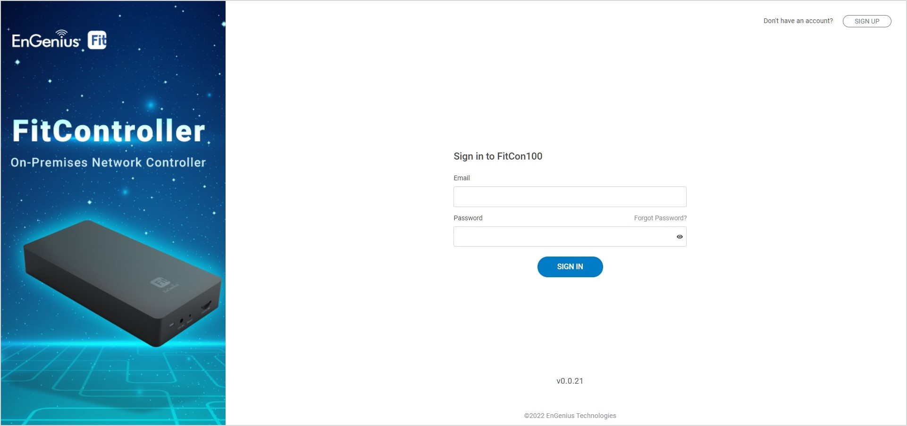

# Option B: On-Premises Management

## <mark style="color:blue;">**Option B: On-premises Management with FitController**</mark> 

### Step 1: Connecting Ethernet&#x20;

Connect the Ethernet cable from the EnGenius Fit AP directly to the DHCP-enabled network, which is the same Layer-2 network as **FitController**.

<figure><figcaption></figcaption></figure>

### Step 2: Log in to the FitController&#x20;

Launch your web browser to access the login page of **FitController** and create an account. Enter the email address and password that you created and click Sign In.

<figure><figcaption></figcaption></figure>


The FitController default IP address in DHCP client mode will get an IP address from the DHCP server. If FitController cannot get an IP address from the DHCP server, the default IP address will be **192.168.1.250:8080.**


### Step 3: Register Device and Assign to Network

1. Go to the _**System > Inventory**_** ** page and click "**Register Device (+)**".
2. FitController will list all EnGenius Fit devices discovered from the same L2 network in the **Pending Approval** section. Select the device and Click "**Register**" to add to inventory.
3. From the **Inventory** page, Select the newly added device and click "**Assign to Network**" to add the device to your personalized network.&#x20;

<figure><figcaption></figcaption></figure>

<figure><figcaption></figcaption></figure>

### **Step 4: Pairing the Device**

1. Go to access point **Device List.**
2. Select the newly added device and click "**Pairing**" to allow the access point to build an encrypted connection between the device and FitController.

<figure><figcaption></figcaption></figure>

### **Step 5: Manage with FitController** 

Navigate to the left side menu to configure & manage your network and view network statistics using the FitController management interface.


For information on configuring and using the **FitController**, refer to the User Guide: [<mark style="background-color:purple;">http://docs.engenius.ai/user-manual-FitController</mark>](https://docs.engenius.ai/fitcontroller-user-manual/)

